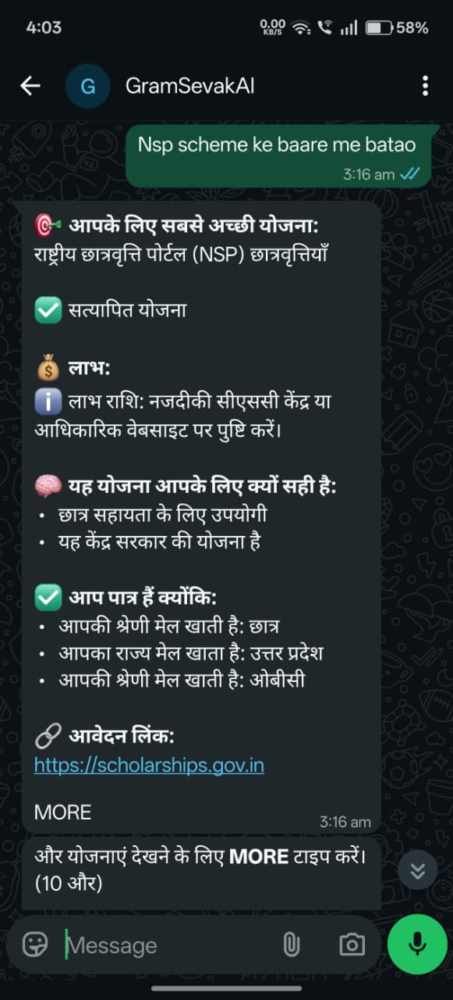
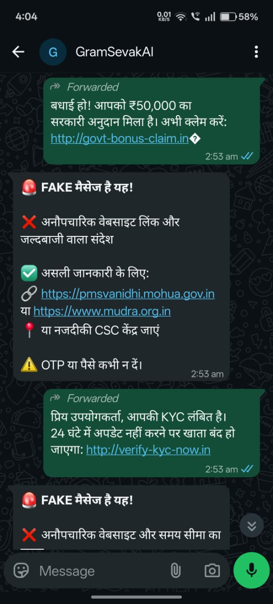
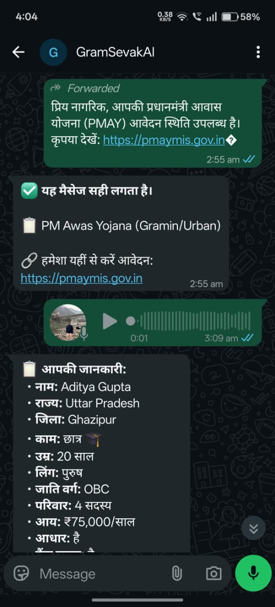
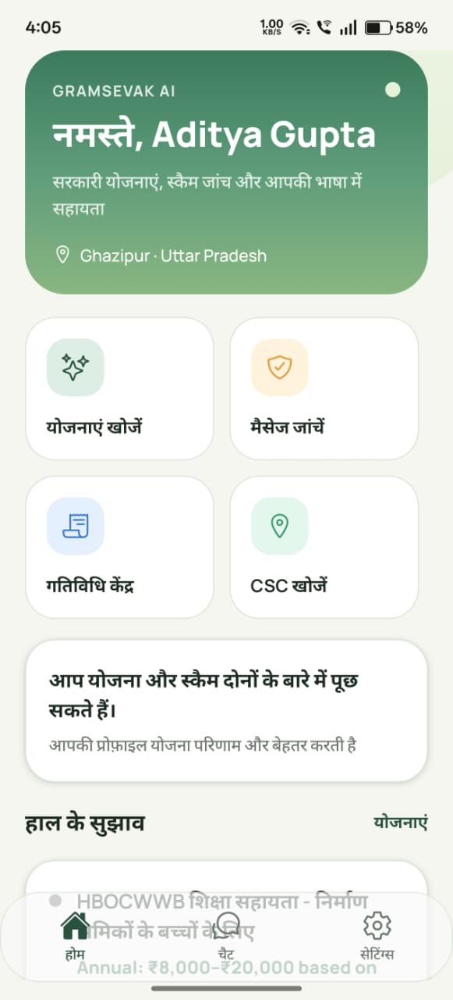
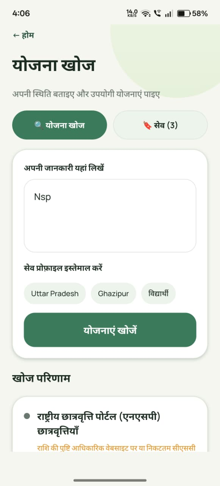
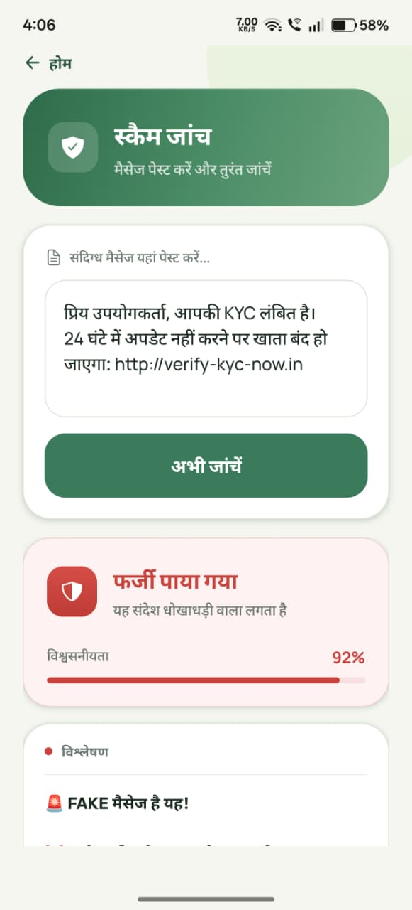
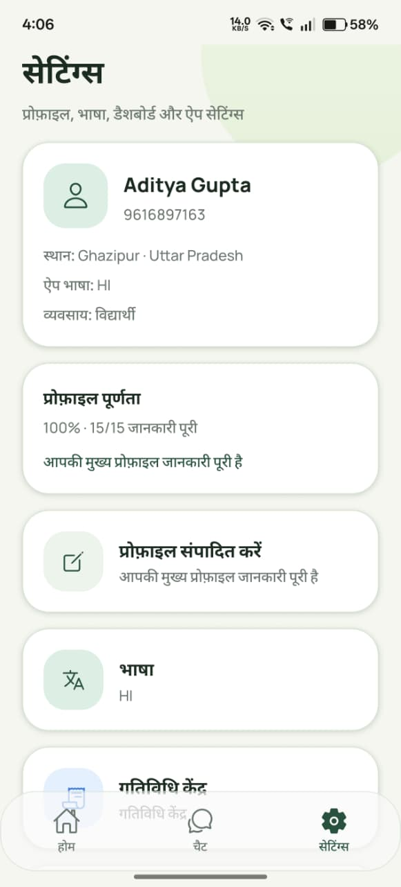

# GramSevak AI HackRust

GramSevak AI is a rural-first assistant focused on two core tasks:

- Discovering relevant Indian government welfare schemes
- Detecting and warning users about scheme-related scams

It supports WhatsApp-first interaction (including voice) and a React Native mobile app.

## Live Backend (Render)

- https://gramsevakai-hackrust-1-0.onrender.com

## Note To Evaluation Team (Why full live WhatsApp link is limited)

We can share the live backend endpoint, but we cannot provide an open WhatsApp live link for everyone to message directly.

Reason:

- Meta WhatsApp Cloud API allows messaging only to approved/verified recipient numbers while app access is restricted (development mode)
- Any number not added in Meta Dashboard is blocked by Meta policy, even if our backend is fully running

How to test from your side:

- Share the phone number to be used for testing
- We will add and verify it in Meta Developer Dashboard
- After verification, that number can chat with the bot normally

## What The System Includes

- Backend: FastAPI APIs, WhatsApp webhook flow, multilingual handling, scheme discovery, scam detection
- Data layer: verified + fallback scheme datasets with search/ranking
- Frontend: Expo React Native app for chat, schemes, profile, and scam check flows

## Screenshots

### WhatsApp (3 Screenshots)

<table>
	<tr>
		<td></td>
		<td></td>
	</tr>
	<tr>
		<td></td>
		<td></td>
	</tr>
</table>

### Mobile App (4 Screenshots)

<table>
	<tr>
		<td></td>
		<td></td>
	</tr>
	<tr>
		<td></td>
		<td></td>
	</tr>
</table>

## Local Run (Quick)

### Backend

1. Go to `Backend`
2. Install dependencies: `pip install -r requirements.txt`
3. Start server: `uvicorn main:app --host 0.0.0.0 --port 8080 --reload`

### Frontend

1. Go to `Frontend/gramsevakai-frontend`
2. Install dependencies: `npm install`
3. Start app: `npx expo start`

---

Apna Hak, Apni Bhasha.
